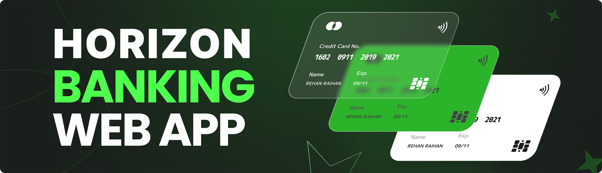

# Horizon Banking Website
 A FinTech bank application.
 
 

**Horizon** - Horizon, built with Next.js, is a user-friendly financial platform. It connects to multiple bank accounts, shows real-time transactions, and allows users to transfer money to each other, making it easy to manage finances in one place.

## Tech Stack
- **Next.js**
- **TypeScript**
- **Appwrite**
- **Plaid**
- **Dwolla**
- **React Hook Form**
- **Zod**
- **TailwindCSS**
- **Chart.js**
- **ShadCN**

## Features

### Authentication
- **Ultra-secure SSR Authentication**: Implements server-side rendering (SSR) for secure user authentication with comprehensive validations and authorization.

### Bank Integration
- **Connect Banks with Plaid**: Easily link multiple bank accounts using Plaid for seamless integration.

### Home Page
- **Account Overview**: Displays a general overview including total balance from all connected banks, recent transactions, spending categories, and more.

### My Banks
- **Bank List and Details**: View a complete list of all connected banks along with their balances and account details.

### Transaction History
- **Advanced Transaction History**: Features pagination and filtering options to view transaction history across different banks.

### Real-time Updates
- **Instant Updates**: Automatically updates all relevant pages when new bank accounts are connected.

### Funds Transfer
- **Seamless Funds Transfer**: Transfer funds using Dwolla with necessary fields and recipient bank ID.

### Responsiveness
- **Responsive Design**: Ensures a consistent and adaptive user experience across desktop, tablet, and mobile devices.

## Test User Account for Deployed Website

To test the Horizon website, I've created a test user account for you. Please use the following credentials to log in and explore the features:

- **Email:** test@horizon.com
- **Password:** test1234

Feel free to navigate through the website and experience all that Horizon has to offer. Let me know if you need any assistance or have feedback!

## Getting Started

Follow these steps to set up the project locally on your machine.

**Prerequisites**

Make sure you have the following installed on your machine:

- [Git](https://git-scm.com/)
- [Node.js](https://nodejs.org/en)
- [npm](https://www.npmjs.com/) (Node Package Manager)

**Cloning the Repository**

```bash
git clone https://github.com/hussain-05/banking-app.git
cd banking
```

**Installation**

Install the project dependencies using npm:

```bash
npm install
```

**Set Up Environment Variables**

Create a new file named `.env.local` in the root of your project and add the following content:

```env
#NEXT
NEXT_PUBLIC_SITE_URL=

#APPWRITE
NEXT_PUBLIC_APPWRITE_ENDPOINT=https://cloud.appwrite.io/v1
NEXT_PUBLIC_APPWRITE_PROJECT=
APPWRITE_DATABASE_ID=
APPWRITE_USER_COLLECTION_ID=
APPWRITE_BANK_COLLECTION_ID=
APPWRITE_TRANSACTION_COLLECTION_ID=
APPWRITE_SECRET=

#PLAID
PLAID_CLIENT_ID=
PLAID_SECRET=
PLAID_ENV=
PLAID_PRODUCTS=
PLAID_COUNTRY_CODES=

#DWOLLA
DWOLLA_KEY=
DWOLLA_SECRET=
DWOLLA_BASE_URL=https://api-sandbox.dwolla.com
DWOLLA_ENV=sandbox

```

Replace the placeholder values with your actual respective account credentials. You can obtain these credentials by signing up on the [Appwrite](https://appwrite.io/?utm_source=youtube&utm_content=reactnative&ref=JSmastery), [Plaid](https://plaid.com/) and [Dwolla](https://www.dwolla.com/)

**Running the Project**

```bash
npm run dev
```

Open [http://localhost:3000](http://localhost:3000) in your browser to view the project.


## Learn More

To learn more about Next.js, take a look at the following resources:

- [Next.js Documentation](https://nextjs.org/docs) - learn about Next.js features and API.
- [Learn Next.js](https://nextjs.org/learn) - an interactive Next.js tutorial.

You can check out [the Next.js GitHub repository](https://github.com/vercel/next.js/) - your feedback and contributions are welcome!

## Deploy on Vercel

The easiest way to deploy your Next.js app is to use the [Vercel Platform](https://vercel.com/new?utm_medium=default-template&filter=next.js&utm_source=create-next-app&utm_campaign=create-next-app-readme) from the creators of Next.js.

Check out their [Next.js deployment documentation](https://nextjs.org/docs/deployment) for more details.
